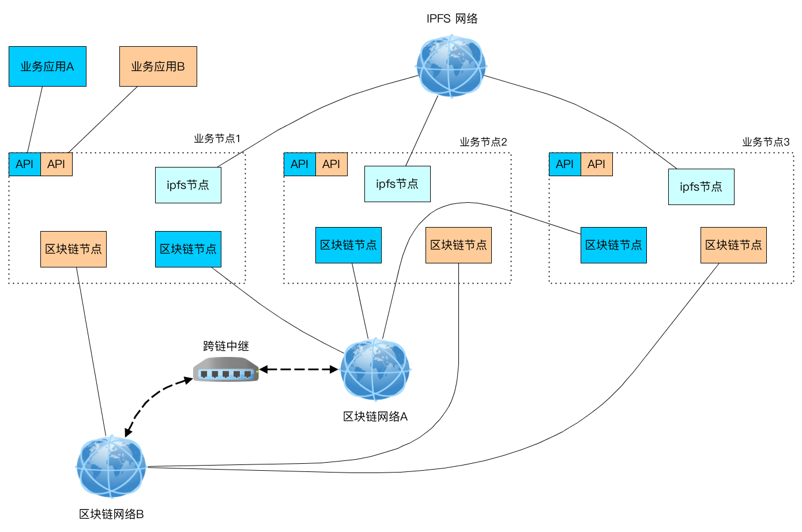
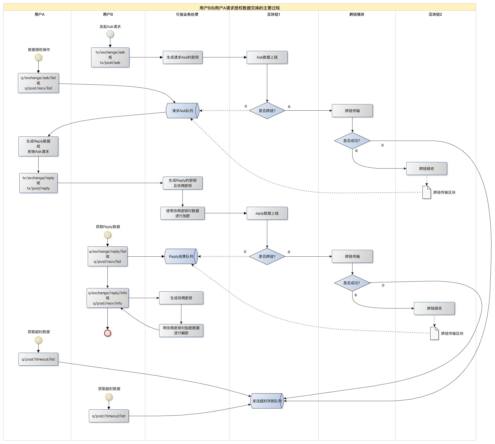

# Ganymede

区块链应用开发平台 ，基于 Cosmos SDK 0.47

## 目标功能

1. 基于POS共识机制，联盟链应用（Cosmos SDK）

2. 支持多应用：数据分隔（多条链）、跨链交互

3. 分布式大块存储（IPFS）

4. 共用基础应用功能

5. 提供API，便于集成业务应用

6. 后台管理平台

## 网络拓扑示意图

## 实现的技术功能点

- [x] 在线链上用户注册、权限管理
	Cosmos sdk 只实现了命令行建链用户，需自己实现api创建过程。

- [x] IPFS服务接口
	私有化ipfs服务部署（对开发侧隐藏，超过尺寸自动存储到ipfs）

- [x] 国密算法支持
	密钥算法支持国密算法(SM2, SM4)；API接口验证支持SM2国密算法

- [x] 业务数据存储设计
	链上数据模型设计，方便业务应用进行数据操作

- [x] 业务数据索引
	用于业务数据的快速检索

- [x] 业务数据密钥：生成、交换、加密、交换
	实现业务数据基于密钥的基础操作

- [x] 业务数据授权、交换
	同一链上不同用户之间；跨链不同用户之间

- [x] 跨链数据交换
	不同链（应用）之间进行基于IBC协议进行数据传递

- [x] 自建IBC Relayer中继
	实现IBC跨链机制

- [ ] 运维相关脚本、可视化管理界面
	新建链、链配置管理、IBC配置；块数据动态统计、展示

## 数据授权（跨链）交换过程

## 开发文档

1. [API文档](doc/API.md)

2. [开发环境准备](doc/DEV.md)

3. [本地测试](doc/TEST.md)

4. [模块设计](doc/MODULES.md)
